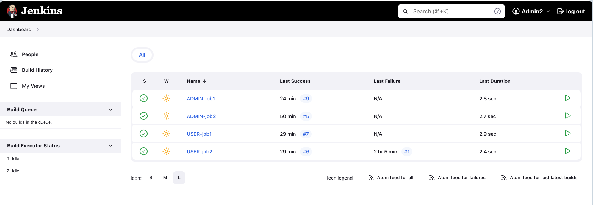
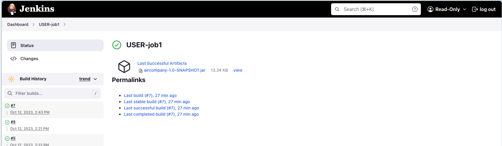

# jenkins-docker-nginx-kubernetes

## Task 1: Install Jenkins (Hands-on lab)
Task: Installing and Configuring Jenkins Server

#### Install and configure Nginx server using Docker to access Jenkins without including the port number in the URL('http://jenkins')
- Docker Compose
- `localhost` -> `jenkins` (local machine: **mac**)
  - change `hosts` file: `sudo nano /etc/hosts` 
  - add `hosts` file: `127.0.0.1  jenkins`
- create file `nginx conf`
- Login and install suggested Jenkins plugins


#### 2. Jenkins settings in the global configuration UI
- Java
- authentication
- email settings

#### 3. Jenkins plugins: 
- Green Balls
- ChuckNorris
- Multiple SCMs
- Email Extension
- Role-based Authorization Strategy

#### 4. Create a freestyle job (hello-jenkins-job)
- simple build step that outputs the message "Hello Jenkins!" to the console (`echo "Hello Jenkins!"`)
- trigger the build and configure the job to build periodically every 5 minutes (`H/5 * * * *`)


#### 5. Create four freestyle jobs: 
- ADMIN-job1
- ADMIN-job2
- USER-job1
- USER-job2


**Job settings**


#### 7. Configure the `Role Based Strategy` plugin
- admin
  - complete control and all privileges
- user
  - view, build, and configure jobs with the prefix 'USER'
- read-only
  - view jobs with the prefix 'USER'

**Role-based Authorization Strategy Settings**


**Availability of jobs for different users**






## Task 2: Jenkins - Continuous Deployment (Hands-on lab)

```
kubectl create -f jenkins.yaml --namespace jenkins
```
```
kubectl apply -f jenkins.yaml
```
```
kubectl get pods
```
```
kubectl logs jenkins-deployment-74866fd7b5-cbkcl
```
```
kubectl run jenkins-deployment-74866fd7b5-cbkcl --image=jenkins --restart=Never
```
```
kubectl version
```
```
minikube version
```
```
minikube start
```
```
minikube status
```
```
minikube stop
```